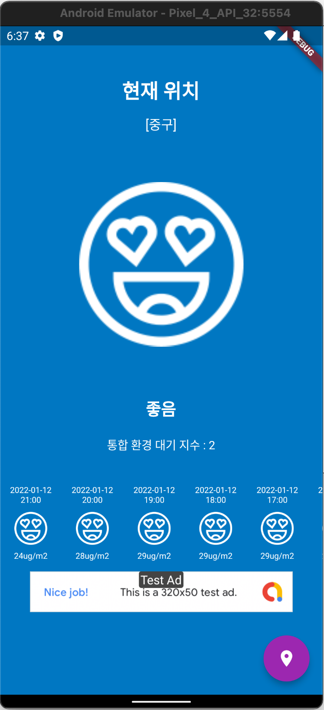
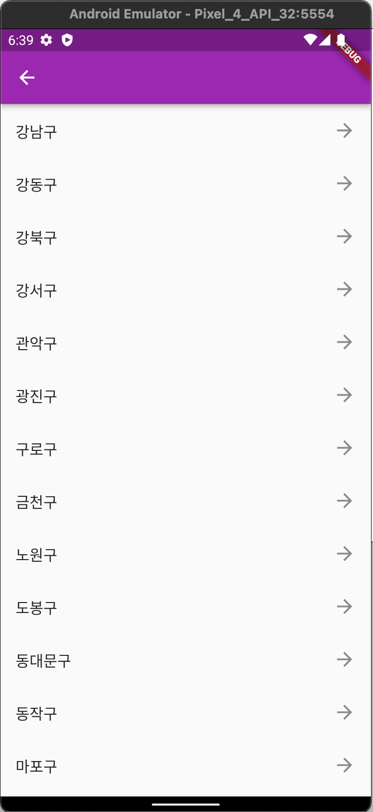
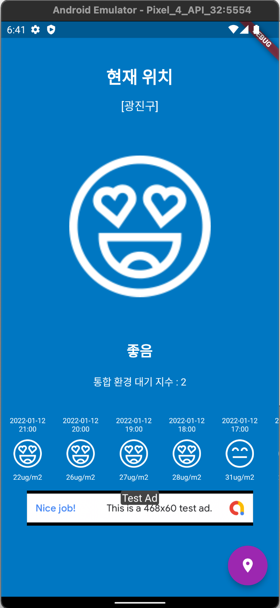
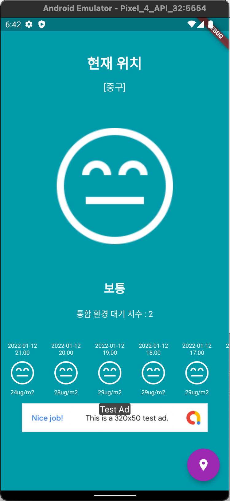
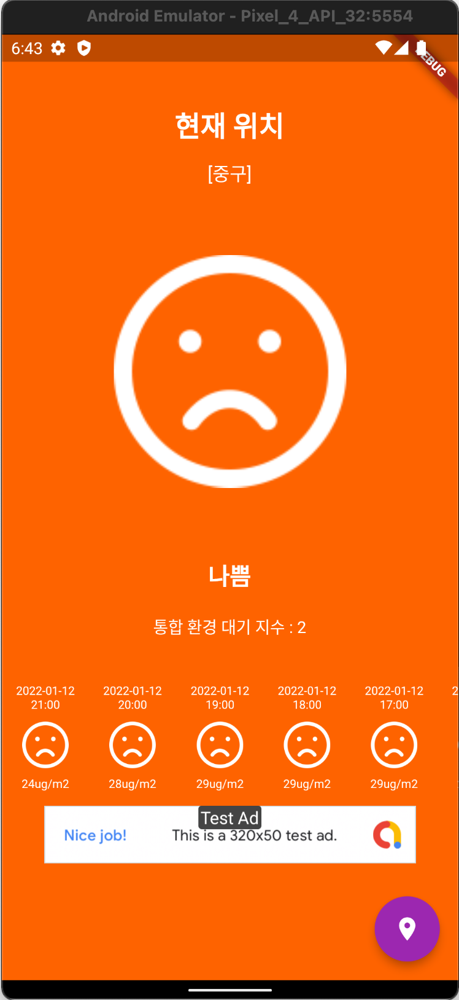
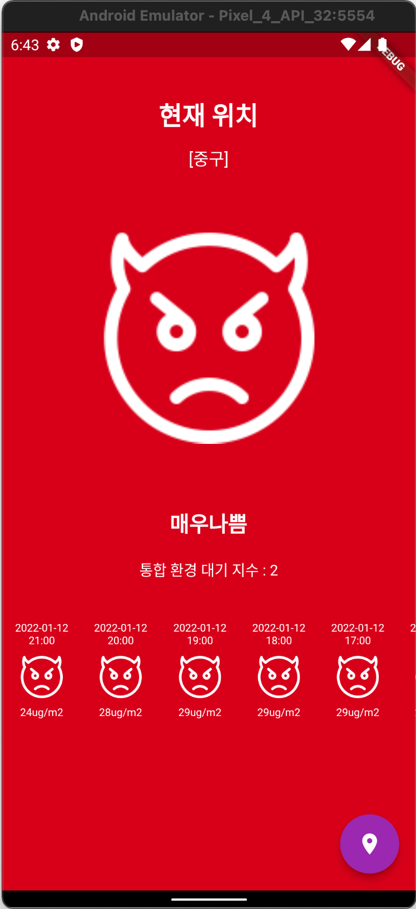

# 미세먼지 Application (Flutter Demo)

## Prerequisite
- URL, Endpoint, API Key 는 환경변수로 설정
- `assets/env/.env` 파일 생성
    ```sh
    BASE_URL= # 공공데이터포털
    ENDPOINT= # 한국환경공단_에어코리아_대기오염정보
    API_KEY=  # 일반 인증키 (Encoding)
    ```

## Screenshots

|  |  |  |
|:--:|:--:|:--:|
|  |  |  |
